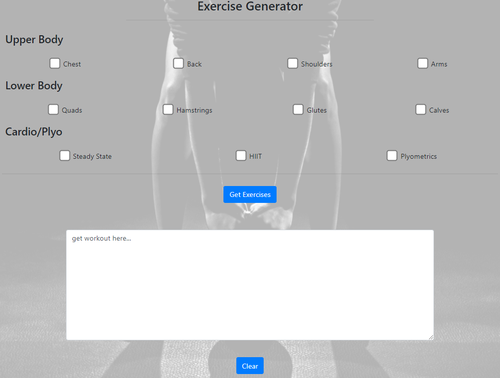
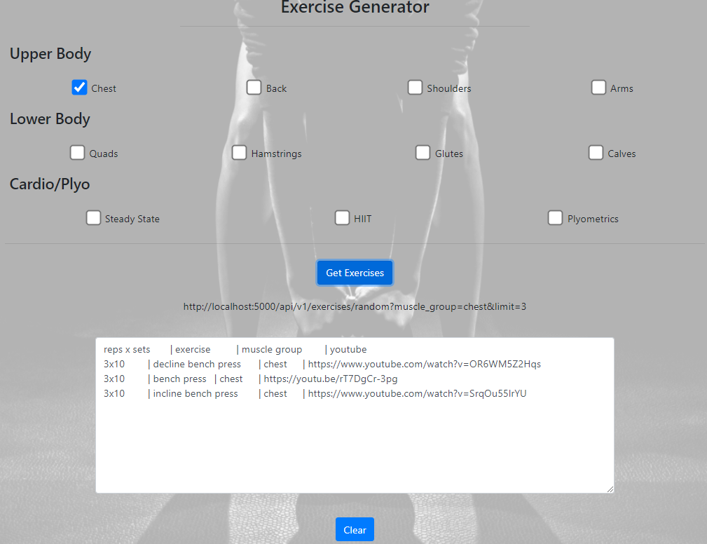
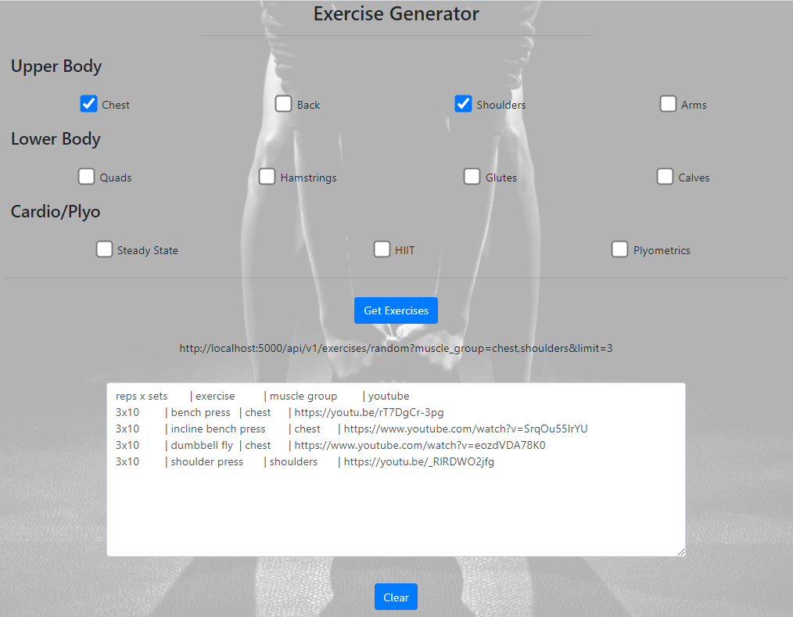
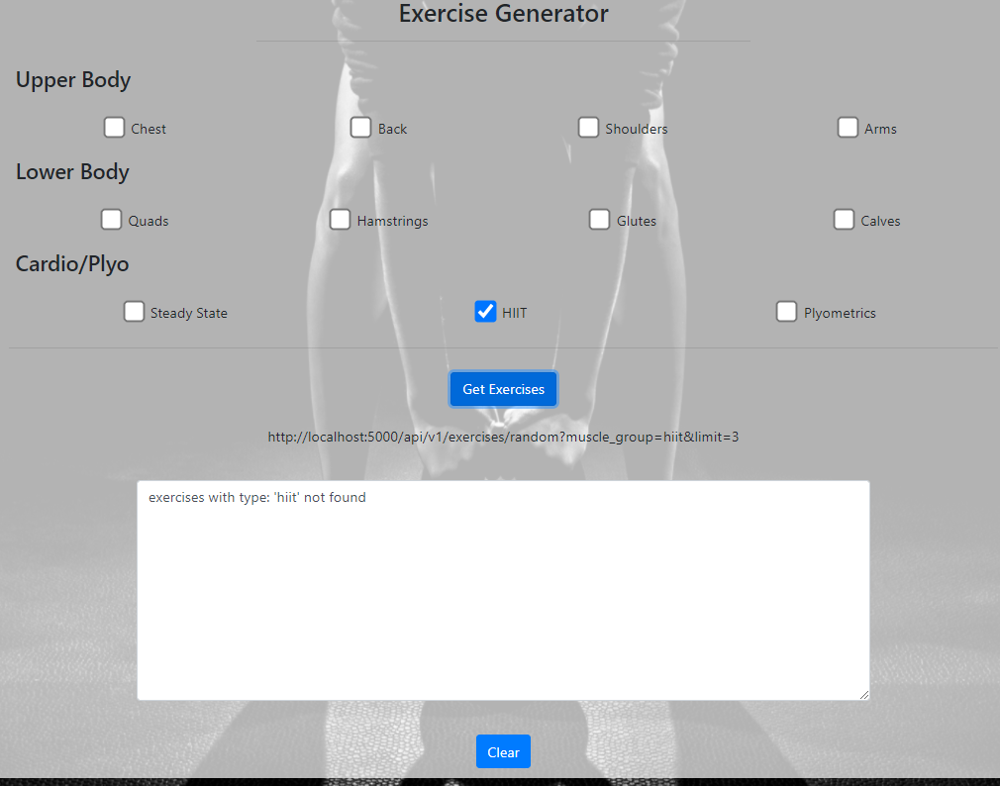

This project was bootstrapped with [Create React App](https://github.com/facebook/create-react-app).

## Project XORCise - The Exercise Generator

### Info
The following project is an exercise generator that was created to randomly generate a work out of the day (WOD) for users who need more motivation to work out during the pandemic.

### Tech Stack
This website was built using the following tech stack

#### Concepts
- REST API development (CRUD for the backend)
    - use of query parameters, path variables
    - retrieve exercises by ID and by muscle group
    - file upload (ie. insert entries into database through a csv file upload)
    - deleting execises by ID
- databse ORM
- MVC model with the use of a service/datamapper layer in Python/Flask 

#### Front-End
- React + JSX
    - Create-React-App
- HTML
- CSS
- JavaScript 
- Bootstrap

#### Back-End
- Python 3.6
- Flask
    - Flask SQLAlchemy (database orm)
- SQL using SQLite database
- repo: https://github.com/andrewh-code/python-xor-size

### How To run:

#### Front-End
- pretty much the same commands you would run in the create-react-app
    - `npm run start`
- front end is hosted ont he default front end React port: 3000

#### Back-End
- This is done using a venv
- create the venv and then execute the following in the directory
    - `python app.py`
- backend is hosted on the default Flask port: 5000

### Screenshots

*SPA front page layout*

*retrieving one type of exercise*

*retriving multiple exercises*

*error handling*

